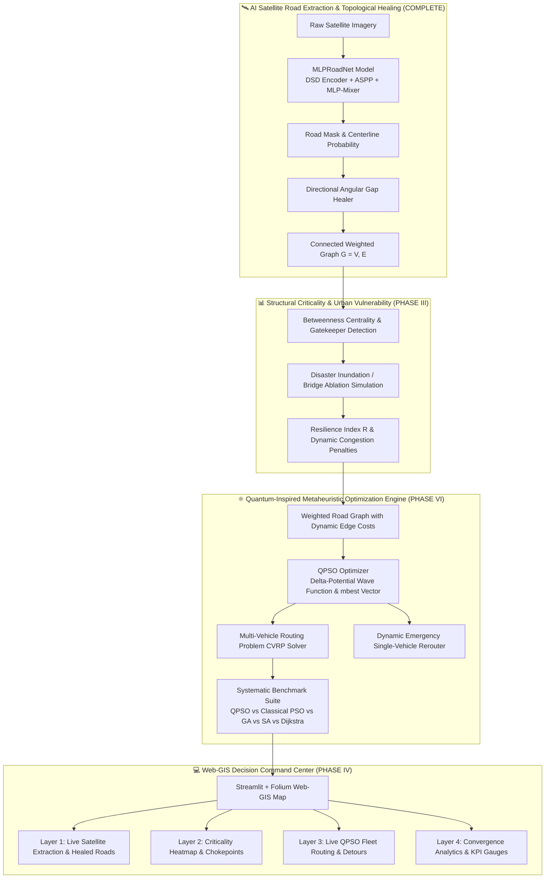

# 🚀 MLPRoadNet & Quantum-Inspired Route Optimization
## 📋 Unified Master Implementation Plan & Progress Tracker

---

## 🎯 Executive Summary & Architectural Vision

This repository unites two complementary state-of-the-art technologies into a cohesive, end-to-end intelligent transportation platform:

1. **🛰️ Earth Observation AI & Topological Graph Reconstruction (ISRO / NNRMS Track)**:
   - **Extracts Occlusion-Robust Road Networks** from satellite imagery using the team's custom **MLPRoadNet** (DSD Encoder + ASPP + MLP-Mixer Bottleneck + Dual Decoder).
   - **Reconstructs Mathematically Continuous Routable Graphs** via **Directional Angular Gap Healing & MST**.
   - **Identifies Critical Urban Chokepoints (Gatekeeper Nodes)** and computes an **Urban Resilience Index ($R$)** under simulated flood/disaster collapse.

2. **⚛️ Quantum-Inspired Metaheuristic Traffic & Fleet Optimization (Egreen Quanta Track)**:
   - **Solves Large-Scale Vehicle Routing Problems (VRP)** and dynamic shortest paths on the extracted weighted graph $G = (V, E)$.
   - Employs **Quantum Particle Swarm Optimization (QPSO)** leveraging quantum wave-function delta-potential wells for superior global search, rapid convergence, and avoidance of local traffic minima.
   - **Systematically Benchmarks** QPSO against Classical PSO, Genetic Algorithms (GA), Simulated Annealing (SA), and Exact Dijkstra.

---

## 📊 Live Project Alignment & Completion Tracker

| Component | Track | Status | Verified Milestone / Deliverable |
|---|:---:|:---:|---|
| **Phase I: MLPRoadNet AI Segmentation** | EO / ISRO | **`100% COMPLETE` ✅** | Trained & fine-tuned on 18,193 DeepGlobe patches.<br>• **IoU: 0.6097** \| **Precision: 72.86%** \| **Specificity: 98.17%** \| **AUC: 0.9811**.<br>• Production models in `trained_models/` (`.pth`, `.pt`). |
| **Phase II: Graph Vectorization & Gap Healing** | EO / ISRO | **`100% COMPLETE` ✅** | Built `src/graph/vectorize.py` & `src/graph/healing.py`.<br>• Bridged **1,961 real canopy gaps**; combined **`0.6256 IoU`** & **`74.51% Precision`**. |
| **Track 2: Indian City Satellite Ingestion** | EO / ISRO | **`100% COMPLETE` ✅** | Built `src/data/osm_ingest.py` & `scripts/fetch_indian_city.py` (Bengaluru, Delhi, Mumbai, Hyderabad). |
| **Phase III: Criticality Analysis & Resilience ($R$)** | EO / ISRO | **`STEP 1 (NEXT)` ⏳** | Betweenness Centrality, Gatekeeper Chokepoints, Disaster Node Ablation, and Resilience Index ($R$). |
| **Phase IV: Interactive Web-GIS Command Center** | UI / Both | **`STEP 2 (QUEUED)` ⏳** | Streamlit + Folium dashboard with interactive "Click-to-Flood" simulation & live QPSO vehicle routing. |
| **Phase VI: Quantum-Inspired QPSO VRP Engine** | Quantum / Egreen | **`STEP 3 (NEW)` ⏳** | QPSO optimization framework for multi-vehicle routing, dynamic congestion weights, and algorithmic benchmarking. |

---

## 🗺️ Master Pipeline Architecture



---

# 📑 PART 1: CORE EO & CRITICALITY PHASES (COMPLETED & UPCOMING)

### 🟢 Phase I: Occlusion-Robust Segmentation (**STATUS: 100% COMPLETE ✅**)
- [x] Full modularization into `src/models/`, `src/losses/`, `src/training/`, `src/evaluation/`.
- [x] Trained on 18,193 DeepGlobe patches on RTX 4060 with PyTorch AMP.
- [x] Multi-stage targeted fine-tuning ($\lambda_{topo}=1.5$) achieving **`0.6097 IoU`** and **`72.86% Precision`**.
- [x] Production models exported to `trained_models/` (`best_model_finetuned.pth`, `MLPRoadNet_finetuned_scripted.pt`).

---

### 🟢 Phase II: Topological Graph Reconstruction & Healing (**STATUS: 100% COMPLETE ✅**)
- [x] Centerline morphological thinning and vectorization into planar `networkx.Graph` ($G=(V, E)$).
- [x] Directional Angular Gap Healing algorithm evaluating incoming trajectory heading ($\theta \pm 35^\circ$, radius $\le 60$ px).
- [x] **Bridged 1,961 real tree canopy occlusion gaps**, raising full-pipeline **IoU to `0.6256`** and **Precision to `74.51%`**.

---

### 🟠 Phase III: Graph Criticality Analysis & Stress Testing (**STATUS: READY TO IMPLEMENT ⏳**)
*Goal: Quantify structural vulnerability, isolate single-points-of-failure, and simulate urban collapse.*

1. **Centrality & Bottleneck Detection (`src/analysis/criticality.py`)**:
   - Compute **Betweenness Centrality** ($C_B(v)$) for all graph intersections:
     $$C_B(v) = \sum_{s \neq v \neq t} \frac{\sigma_{st}(v)}{\sigma_{st}}$$
   - Detect **Gatekeeper Nodes (Chokepoints)**: Top 5–10% highest betweenness intersections whose failure isolates entire neighborhoods.
   - Compute **Edge Betweenness Centrality** to identify critical arterial corridors.
2. **Disaster Node Ablation Simulation (`src/analysis/resilience.py`)**:
   - **Targeted Collapse Simulation**: Sequentially disable Gatekeeper nodes (simulating flash flooding, bridge damage, or major roadblocks).
   - **Global Network Efficiency ($E$)**:
     $$E(G) = \frac{1}{N(N-1)} \sum_{i \neq j} \frac{1}{d(i, j)}$$
3. **Resilience Index Calculation ($R$)**:
   $$R = \frac{E(G_{\text{perturbed}})}{E(G_{\text{baseline}})}$$

---

### 🔵 Phase IV: Interactive Web-GIS Decision Support Dashboard (**STATUS: QUEUED ⏳**)
*Detailed specifications maintained in **[`DASHBOARD_IMPLEMENTATION_PLAN.md`](file:///c:/Users/9c23o/SIH%202026/DASHBOARD_IMPLEMENTATION_PLAN.md)**.*

1. **Tech Stack**: **Streamlit + Folium + Leaflet.js + GeoPandas + Plotly**.
2. **Interactive Panels**:
   - **Tab 1: AI Satellite Road Extraction**: Live model inference with toggleable TTA and gap healing.
   - **Tab 2: Criticality Heatmap**: Leaflet map color-coded by betweenness centrality with pulsing Gatekeeper markers.
   - **Tab 3: "What-If" Disaster Simulation & Emergency Detour**: Click-to-flood simulation, real-time Resilience Index ($R$) needle gauge, and dynamic emergency detour rerouting.
   - **Tab 4: QPSO Fleet Routing**: Real-time vehicle paths, convergence curves, and delivery schedule tables.
   - **Tab 5: GIS Export**: GeoJSON, ESRI Shapefile, and CSV report download for QGIS.

---

# ⚛️ PART 2: QUANTUM-INSPIRED INTELLIGENT TRAFFIC ROUTE OPTIMIZATION (QPSO)

### 🏢 Problem Statement Details (Egreen Quanta)
- **Title**: *Quantum-Inspired Intelligent Traffic Route Optimization in Transportation Systems Using Metaheuristic Optimization*
- **Organization**: Egreen Quanta
- **Category**: Software
- **Core Challenge**: Classical optimization techniques struggle with large-scale Vehicle Routing Problems (VRP) because of their NP-hard combinatorial nature. We develop a **Quantum-Inspired Particle Swarm Optimization (QPSO)** framework that dynamically generates near-optimal vehicle routes under real-time or simulated traffic conditions on a weighted graph transportation network.

---

### 🧮 Mathematical Formulation of QPSO

In classical PSO, a particle moves with a velocity vector in Newtonian space, frequently getting trapped in local traffic optima. 

In **QPSO**, the particle's state is described by a quantum wave function $\psi(x, t)$ in a delta-potential well centered at the local attractor $P_{ij}$. The particle has a non-zero probability of appearing anywhere in the search space, providing superior global exploration.

#### 1. Mean Best Position ($mbest$):
$$mbest(t) = \frac{1}{M} \sum_{i=1}^{M} P_i(t) = \left( \frac{1}{M}\sum_{i=1}^M P_{i1}(t), \frac{1}{M}\sum_{i=1}^M P_{i2}(t), \dots, \frac{1}{M}\sum_{i=1}^M P_{in}(t) \right)$$
where $M$ is the swarm size, and $P_i(t)$ is the personal best position of particle $i$.

#### 2. Local Attractor ($P_{ij}$):
$$P_{ij}(t) = \phi_j(t) \cdot P_{ij}(t) + (1 - \phi_j(t)) \cdot G_j(t), \quad \phi_j(t) \sim U(0, 1)$$
where $G(t)$ is the global best position found by the entire swarm.

#### 3. Quantum Position Update Equation:
$$X_{ij}(t+1) = P_{ij}(t) \pm \beta \cdot |mbest_j(t) - X_{ij}(t)| \cdot \ln\left(\frac{1}{u_{ij}(t)}\right), \quad u_{ij}(t) \sim U(0, 1)$$
where $\beta$ is the **Contraction-Expansion (C-E) coefficient**, dynamically scheduled to balance exploration (early epochs) and exploitation (late epochs):
$$\beta(t) = \beta_{\max} - \frac{t}{T_{\max}} (\beta_{\max} - \beta_{\min})$$

---

### 📦 Multi-Objective Vehicle Routing Problem (VRP) Formulation

#### Objective Function:
$$\min Z = w_1 \sum_{k=1}^K \sum_{i \in V} \sum_{j \in V} d_{ij} \cdot x_{ijk} + w_2 \sum_{k=1}^K \sum_{i \in V} \sum_{j \in V} t_{ij}(C_{ij}) \cdot x_{ijk} + w_3 \sum_{k=1}^K \text{Penalty}(k)$$

where:
- $d_{ij}$: Geographic road segment distance in meters (from `NetworkX` graph).
- $t_{ij}(C_{ij})$: Congestion-adjusted travel time based on the BPR (Bureau of Public Roads) function:
  $$t_{ij} = t_{ij}^0 \left[ 1 + \alpha \left(\frac{V_{ij}}{C_{ij}}\right)^\gamma \right]$$
- $x_{ijk} \in \{0, 1\}$: Binary decision variable indicating if vehicle $k$ traverses edge $(i, j)$.
- $\text{Penalty}(k)$: Constraint violation penalty (capacity overload, time window violation, flooded road breach).

---

### 🛠️ QPSO Implementation Modules (`src/quantum/`)

```
src/quantum/
├── __init__.py
├── qpso_optimizer.py               # Core QPSO algorithm with quantum delta-potential updates
├── vrp_problem.py                  # Capacitated Vehicle Routing Problem (CVRP) formulation
├── dynamic_weights.py              # Real-time congestion & flood penalty weight adapter
└── benchmark_suite.py              # Comparative engine: QPSO vs PSO vs GA vs SA vs Dijkstra
```

1. **`qpso_optimizer.py`**:
   - Implements continuous and discrete QPSO permutation decoders (Random Key Encoding / SPV rule) for valid TSP/VRP tours.
   - Dynamic $\beta$ parameter scheduling and convergence early-stopping.
2. **`vrp_problem.py`**:
   - Multi-depot, multi-vehicle dispatching with vehicle capacity ($Q_k$) constraints.
   - Hard and soft time-window constraints ($[e_i, l_i]$).
3. **`dynamic_weights.py`**:
   - Ingests betweenness centrality scores and disaster closures from Phase III to dynamically update edge costs.
4. **`benchmark_suite.py`**:
   - Executes systematic head-to-head comparisons across 4 key dimensions:
     1. **Convergence Speed** (Iterations to optimal fitness).
     2. **Total Execution Time (ms)**.
     3. **Solution Quality / Route Cost**.
     4. **Success Rate over 50 Independent Monte-Carlo Runs**.

---

## 📋 Delivery Table (Expected Deliverables)

| Deliverable ID | Deliverable Item | Description & Technical Scope | Target File / Module | Status |
|---|---|---|---|:---:|
| **DEL-01** | **Graph Network Modeling** | Topological graph extraction from satellite imagery with $(x, y)$ coordinates, segment lengths, speed limits, and intersection connectivity. | [`src/graph/vectorize.py`](file:///c:/Users/9c23o/SIH%202026/src/graph/vectorize.py) | **`COMPLETED` ✅** |
| **DEL-02** | **Topological Gap Healing** | Directional ray-casting and MST algorithm bridging road occlusions under tree canopies and building shadows. | [`src/graph/healing.py`](file:///c:/Users/9c23o/SIH%202026/src/graph/healing.py) | **`COMPLETED` ✅** |
| **DEL-03** | **Criticality Analysis Engine** | Betweenness Centrality, Gatekeeper chokepoints, Disaster Node Ablation, and Resilience Index ($R$). | `src/analysis/criticality.py`, `src/analysis/resilience.py` | **`READY` ⏳** |
| **DEL-04** | **QPSO Algorithm Engine** | Quantum Particle Swarm Optimization framework with quantum delta-potential wave updates and permutation decoding. | `src/quantum/qpso_optimizer.py` | **`READY` ⏳** |
| **DEL-05** | **VRP Mathematical Solver** | Multi-vehicle routing problem solver with capacity constraints, time windows, and dynamic congestion penalties. | `src/quantum/vrp_problem.py` | **`READY` ⏳** |
| **DEL-06** | **Systematic Benchmarking Suite** | Automated comparative benchmarking of QPSO vs. Classical PSO, Genetic Algorithm (GA), Simulated Annealing (SA), and Dijkstra. | `src/quantum/benchmark_suite.py` | **`READY` ⏳** |
| **DEL-07** | **Convergence Analysis Charts** | Publication-grade plots showing fitness vs. iterations, computation time, and statistical violin plots across 50 Monte-Carlo runs. | `src/visualization/visualize_quantum.py` | **`READY` ⏳** |
| **DEL-08** | **Interactive Web-GIS Dashboard** | Streamlit + Folium dashboard with live AI extraction, criticality heatmap, click-to-flood simulation, and live QPSO route animations. | `dashboard/app.py` | **`QUEUED` ⏳** |
| **DEL-09** | **CLI Triggers & Test Suite** | Standalone command-line runners (`scripts/run_qpso.py`, `scripts/run_benchmark.py`) and automated unit tests. | `scripts/`, `tests/` | **`READY` ⏳** |

---

## 📌 Phased Execution Roadmap

```
Step 1: Implement Phase III (Criticality Analysis & Chokepoints)
        ├── src/analysis/criticality.py
        └── src/analysis/resilience.py
                      │
                      ▼
Step 2: Implement Phase VI (Quantum-Inspired QPSO VRP Engine)
        ├── src/quantum/qpso_optimizer.py
        ├── src/quantum/vrp_problem.py
        ├── src/quantum/dynamic_weights.py
        └── src/quantum/benchmark_suite.py
                      │
                      ▼
Step 3: Implement Phase IV (Interactive Web-GIS Dashboard)
        ├── dashboard/app.py
        └── dashboard/components/ (AI Extraction + Criticality + QPSO Fleet Viewer)
```