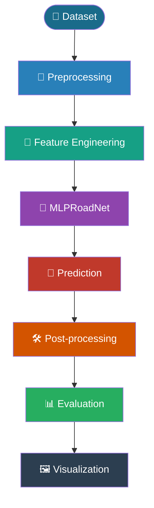
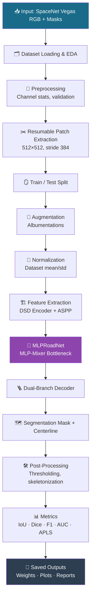
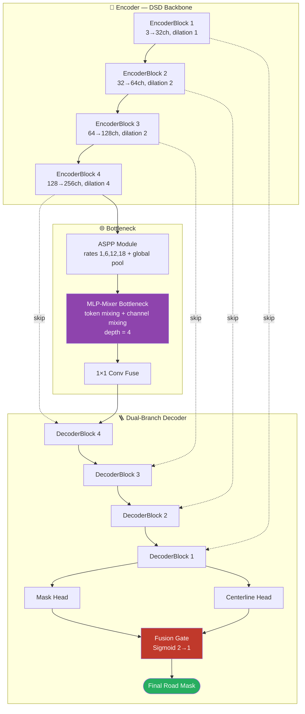
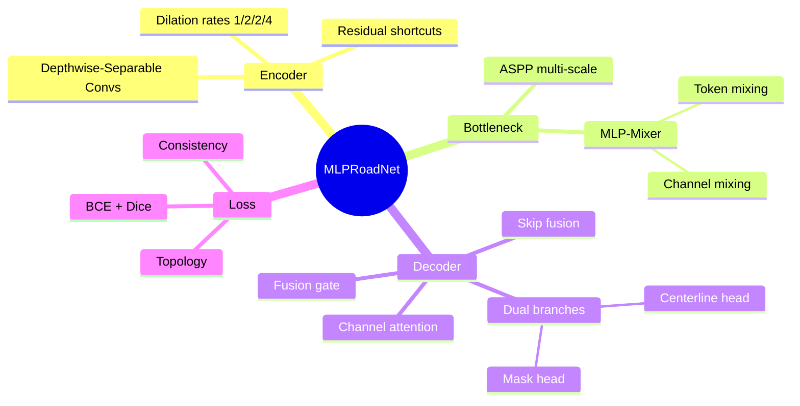
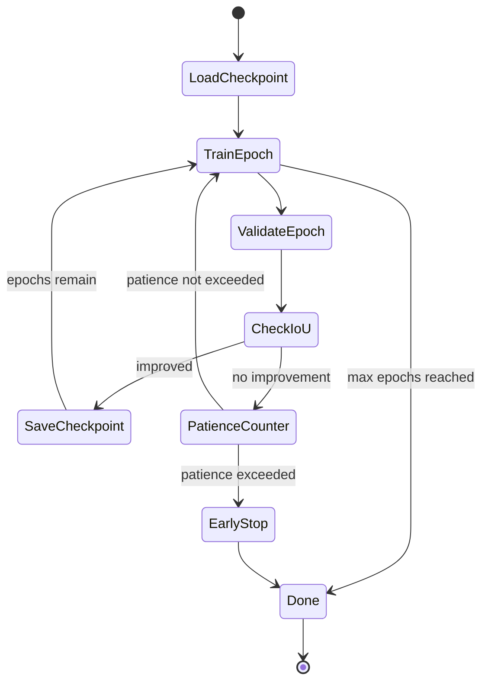
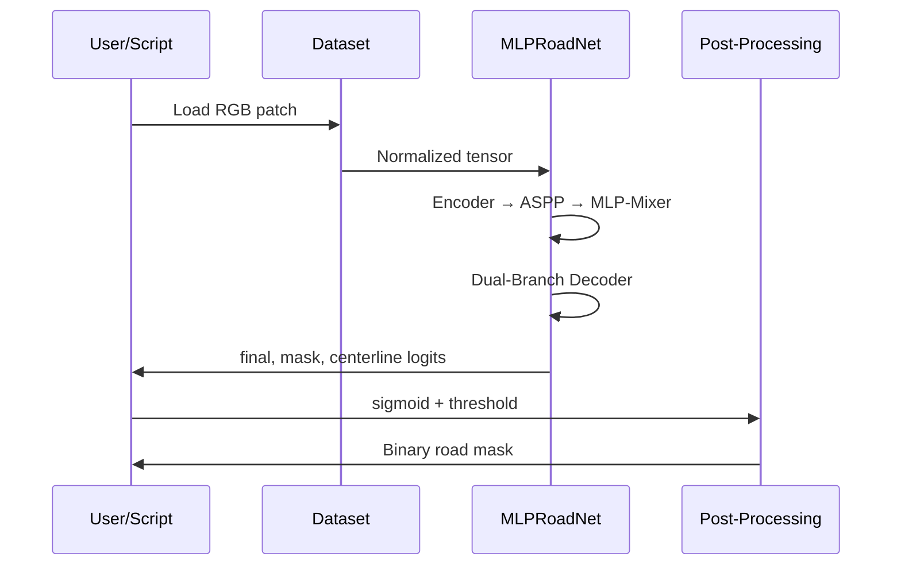

<div align="center">

# 🛣️ MLPRoadNet

### A Novel Hybrid MLP–CNN Architecture for Road Extraction from Satellite Imagery


*Encoder–ASPP–MLP-Mixer–Dual-Branch architecture for binary road segmentation on SpaceNet Vegas*

[](https://www.python.org/)
[](https://pytorch.org/)
[](https://opencv.org/)
[](https://scikit-learn.org/)
[](https://jupyter.org/)
[](#)
[](#)
[](#-license)

</div>

---

## 📋 Table of Contents

<details>
<summary>Click to expand</summary>

1. [Project Overview](#-1-project-overview)
2. [Key Features](#-2-key-features)
3. [Animated Workflow](#-3-animated-workflow)
4. [Complete Pipeline](#-4-complete-pipeline)
5. [Architecture](#-5-architecture)
6. [Architecture Deep Dive — Module by Module](#-6-architecture-deep-dive--module-by-module)
7. [Repository Structure](#-7-repository-structure)
8. [Dataset](#-8-dataset)
9. [Installation](#-9-installation)
10. [Execution Pipeline](#-10-execution-pipeline)
11. [Complete Workflow Illustration](#-11-complete-workflow-illustration)
12. [MLPRoadNet Deep Dive](#-12-mlproadnet-deep-dive)
13. [Baseline Comparison](#-13-baseline-comparison)
14. [Ablation Study](#-14-ablation-study)
15. [Visual Results](#-15-visual-results)
16. [Training Visualizations](#-16-training-visualizations)
17. [Interactive Diagrams](#-17-interactive-diagrams)
18. [Technology Stack](#-18-technology-stack)
19. [Configuration](#-19-configuration)
20. [Outputs](#-20-outputs)
21. [Future Improvements](#-21-future-improvements)
22. [Applications](#-22-applications)
23. [Citation](#-23-citation)
24. [License](#-24-license)
25. [Author](#-25-author)
26. [Acknowledgements](#-26-acknowledgements)

</details>

---

## 🧭 1. Project Overview

**MLPRoadNet** is an end-to-end deep learning pipeline for **binary road extraction** from high-resolution satellite imagery, built and validated on the **SpaceNet Vegas** dataset. The notebook implements the *entire* lifecycle of a research-grade segmentation project — from raw GeoTIFF/PNG patch extraction, through a custom hybrid encoder–MLP-Mixer–dual-branch decoder architecture, to full evaluation, ablation studies, and qualitative dashboards.

**Why road extraction matters:** Automated road-network mapping from satellite/aerial imagery underpins GIS updates, disaster-response routing, autonomous-vehicle map priors, and urban-planning analytics — domains where manual digitization is slow, expensive, and difficult to scale globally.

**Why traditional approaches struggle:** Classical CNN encoder–decoder segmentation models (e.g. U-Net, D-LinkNet) excel at local texture discrimination but have limited *global* spatial reasoning at the bottleneck, often producing fragmented, topologically broken road predictions — a problem made worse by noisy or inconsistent ground-truth labels common in remote-sensing datasets.

**Why MLPRoadNet is proposed:** MLPRoadNet addresses this gap with a **Depthwise-Separable Dilated (DSD) encoder** for lightweight local feature extraction, an **ASPP + MLP-Mixer bottleneck** for efficient global context modeling (avoiding the quadratic cost of self-attention), and a **dual-branch decoder** that jointly predicts the road mask and its centerline/topology, fused through a learned gate and regularised with a consistency + topology-aware loss for more geometrically coherent road networks.

> ⚠️ **Scope note:** This README describes exactly what is implemented in the accompanying notebook (`MLPRoadNet_SpaceNet_Vegas_Final.ipynb`). No experimental results, benchmark numbers, or datasets beyond what the notebook produces are claimed here — all quantitative cells are left as placeholders for you to fill in after running your own experiments.

---

## ✨ 2. Key Features

| | Feature | Description |
|---|---|---|
| ✅ | **Hybrid CNN + MLP Architecture** | Combines convolutional locality with MLP-Mixer global token mixing |
| ✅ | **Lightweight Encoder** | Depthwise-Separable Dilated convolutions — fewer parameters than a comparable U-Net |
| ✅ | **ASPP Multi-Scale Context** | Atrous Spatial Pyramid Pooling with rates `[1, 6, 12, 18]` + global pooling branch |
| ✅ | **Dual-Branch Decoder** | Simultaneous road-mask + centerline/topology prediction |
| ✅ | **Learned Fusion Gate** | Sigmoid-gated combination of mask and centerline branches into the final prediction |
| ✅ | **Composite Loss Function** | BCE + Dice (main + auxiliary branches) + Consistency + Topology continuity terms |
| ✅ | **Noisy-Label Robustness** | Heuristic suspicious-mask detection with adaptive label smoothing |
| ✅ | **Resumable Patch Extraction** | Fail-safe 512×512 tiling that skips already-processed images on re-run |
| ✅ | **Resumable Training** | Per-epoch checkpointing with early stopping on validation IoU |
| ✅ | **Full Evaluation Suite** | F1, Accuracy, IoU, Precision, Recall, Specificity, Dice, AUC, approximate APLS |
| ✅ | **Qualitative Visualization Grids** | RGB / GT / prediction / centerline skeleton / TP-FP-FN overlay panels |
| ✅ | **5-Variant Ablation Study** | Systematically removes each novel component to measure its contribution |
| ✅ | **Multi-Format Export** | PyTorch `.pth`, TorchScript `.pt`, and ONNX (opset 13) |
| ✅ | **Self-Contained Comparison Dashboard** | ROC/AUC, confusion matrix, metrics table, 4-image fixed comparison grid |

---

## 🌀 3. Animated Workflow



---

## 🔄 4. Complete Pipeline



---

## 🏗️ 5. Architecture



---

## 🔬 6. Architecture Deep Dive — Module by Module

<details>
<summary><b>🧱 EncoderBlock (DSD — Depthwise-Separable Dilated)</b></summary>

| | |
|---|---|
| **Purpose** | Extract local spatial features cheaply while progressively expanding the receptive field via dilation |
| **Input** | Feature map `(B, C_in, H, W)` |
| **Output** | Pooled feature map `(B, C_out, H/2, W/2)` + skip tensor `(B, C_out, H, W)` |
| **Composition** | Two `DepthwiseSeparableConv` layers + a 1×1 residual shortcut + `MaxPool2d(2,2)` |
| **Importance** | Keeps parameter count below an equivalent dense-conv U-Net while retaining strong feature locality |
| **Feeds into** | Next `EncoderBlock`, and its skip tensor is passed directly to the matching `DecoderBlock` |
| **Advantage** | Depthwise separation drastically cuts FLOPs/params vs. standard 3×3 convolutions |

</details>

<details>
<summary><b>🌐 ASPP Module (Atrous Spatial Pyramid Pooling)</b></summary>

| | |
|---|---|
| **Purpose** | Capture multi-scale spatial context at the bottleneck before global token mixing |
| **Input** | Deepest encoder feature map `(B, 8c, H/16, W/16)` |
| **Output** | Multi-scale fused feature map of the same spatial size |
| **Composition** | 4 dilated-conv branches (rates 1, 6, 12, 18) + a global-average-pool branch, concatenated and fused with a 1×1 conv |
| **Importance** | Lets the network see road structures at multiple scales — important since roads vary widely in width and curvature |
| **Feeds into** | `MLPMixerBottleneck` |

</details>

<details>
<summary><b>🧠 MLP-Mixer Bottleneck (Key Novelty)</b></summary>

| | |
|---|---|
| **Purpose** | Provide **global spatial reasoning** across the entire feature map without the quadratic cost of self-attention |
| **Input** | ASPP output, flattened into spatial tokens `(B, N, C)` |
| **Output** | Mixed tokens reshaped back to `(B, C, H, W)` |
| **Composition** | Stack of `MLPMixerLayer`s (`MLP_DEPTH` = 4 by default), each performing **token-mixing** (MLP across spatial positions) followed by **channel-mixing** (MLP across channels), both with residual connections and LayerNorm |
| **Importance** | This is the architectural feature that distinguishes MLPRoadNet from U-Net / D-LinkNet — it lets distant road segments "communicate" so that long, thin, occluded road structures are reasoned about jointly rather than purely locally |
| **Feeds into** | `bn_fuse` 1×1 conv, then the decoder |
| **Advantage** | Linear-ish complexity in tokens vs. quadratic for attention, while still modeling global context |

</details>

<details>
<summary><b>🪜 DecoderBlock</b></summary>

| | |
|---|---|
| **Purpose** | Progressively upsample bottleneck features back to full resolution while re-injecting encoder detail |
| **Input** | Lower-resolution feature map + corresponding encoder skip tensor |
| **Output** | Upsampled, fused feature map at the skip's resolution |
| **Composition** | Bilinear upsample → concatenate with skip → two `DepthwiseSeparableConv` layers → `ChannelAttention` (Squeeze-and-Excitation) |
| **Importance** | Recovers fine spatial detail (thin road edges) lost during downsampling |
| **Feeds into** | Next `DecoderBlock`, or the dual prediction heads after the final block |

</details>

<details>
<summary><b>🛣️ Dual-Branch Heads + Fusion Gate</b></summary>

| | |
|---|---|
| **Purpose** | Predict the road mask and its centerline/topology *jointly*, then fuse them adaptively |
| **Input** | Final decoder feature map `(B, c, H, W)` |
| **Output** | `final_logit`, `mask_logit`, `cline_logit` — three single-channel maps |
| **Composition** | Two independent conv heads (`mask_head`, `cline_head`) + a 2→1 channel sigmoid `fusion_gate` that computes `final = gate·mask + (1-gate)·cline` |
| **Importance** | Encourages the network to learn geometrically consistent, less fragmented road predictions by supervising both the area and the skeleton of the road |
| **Advantage** | The gate lets the model learn, per-pixel, how much to trust the mask branch vs. the centerline branch |

</details>

---

## 📁 7. Repository Structure

```
MLPRoadNet/
│
├── notebooks/
│   └── MLPRoadNet_SpaceNet_Vegas_Final.ipynb   # Complete end-to-end pipeline
│
├── datasets/
│   └── SpaceNet_Vegas/
│       ├── images/                              # RGB satellite tiles
│       └── masks/                                # Binary road masks
│
├── checkpoints/                                  # Saved during training (generated)
│   ├── best_model.pth
│   └── ablation_<variant>_best.pth
│
├── outputs/
│   ├── patches/                                  # Extracted 512×512 patches (generated)
│   ├── results/                                  # Metrics, plots, reports (generated)
│   ├── exports/                                  # .pth / .pt / .onnx exports (generated)
│   └── logs/                                     # Training logs (generated)
│
├── assets/
│   ├── banner.png                                # README hero banner (add your own)
│   └── results/                                  # Place qualitative screenshots here
│
├── README.md
├── requirements.txt
└── LICENSE
```

> 📌 Folders marked **(generated)** are created automatically by the notebook on first run via `CFG['OUTPUT_DIR']`.

---

## 🗺️ 8. Dataset

**Dataset:** [SpaceNet Vegas](https://spacenet.ai/) — 8-bit RGB satellite imagery with paired binary road masks.

**Expected directory layout** (set via `DATASET_ROOT` in Section 2 of the notebook):

```
SpaceNet_Vegas/
├── images/
│   ├── tile_0001.tif   (or .png / .jpg)
│   ├── tile_0002.tif
│   └── ...
└── masks/
    ├── tile_0001.tif   # binary mask, same filename stem as its image
    ├── tile_0002.tif
    └── ...
```

| Requirement | Detail |
|---|---|
| **Image format** | `.tif`, `.tiff`, `.png`, or `.jpg` (configurable via `CFG['IMG_EXT']`) |
| **Mask format** | Single-channel binary mask, matching filename stem to its image |
| **Pairing rule** | Image and mask must share the same filename stem in their respective folders |
| **Patch size** | 512×512 (configurable via `CFG['PATCH_SIZE']`) |
| **Patch stride** | 384 → 128px overlap (configurable via `CFG['PATCH_STRIDE']`) |
| **Min road content** | Patches with < 1% road pixels are discarded (`CFG['MIN_ROAD_RATIO']`) |
| **Train/Test split** | 85% / 15% by default (`CFG['TEST_SPLIT']`), shuffled with a fixed seed |

---

## ⚙️ 9. Installation

```bash
# 1. Clone the repository
git clone https://github.com/<your-username>/MLPRoadNet.git
cd MLPRoadNet

# 2. Create and activate a virtual environment
python -m venv venv
# Windows
venv\Scripts\activate
# Linux / macOS
source venv/bin/activate

# 3. Install dependencies
pip install -r requirements.txt
```

> ℹ️ The notebook's **Section 1** also self-installs any missing packages automatically (Windows-safe, no Linux-only libraries required), so a clean Python 3.9+ environment is sufficient even without a pre-existing `requirements.txt`.

```bash
# 4. Launch the notebook
jupyter notebook notebooks/MLPRoadNet_SpaceNet_Vegas_Final.ipynb
```

**Before running:** edit the two path variables at the top of **Section 2 (Global Configuration)**:

```python
DATASET_ROOT = r'C:/path/to/SpaceNet_Vegas'
OUTPUT_DIR   = r'C:/path/to/mlproadnet_output'
```

---

## 🚀 10. Execution Pipeline

Run the notebook **top-to-bottom, in order** — every section depends on state from earlier ones.

| # | Section | What it does | Must run? |
|---|---|---|---|
| 1 | Installation & Imports | Installs packages, sets seeds, detects GPU | ✅ Always |
| 2 | Global Configuration | Sets all paths & hyperparameters | ✅ Always — edit paths first |
| 3 | Dataset Inspection & EDA | Scans image-mask pairs, computes channel stats | ✅ Always |
| 4 | Patch Extraction | Slices images into 512×512 patches (resumable) | ✅ First run (auto-skips if done) |
| 5 | Train/Test Split | Shuffles and splits patch index | ✅ Always |
| 6 | Augmentation Pipeline | Defines train/test-time transforms | ✅ Always |
| 7 | Dataset Class & DataLoaders | Builds PyTorch Dataset & DataLoader objects | ✅ Always |
| 8 | MLPRoadNet Architecture | Defines model, verifies output shapes | ✅ Always |
| 9 | Loss Functions | Defines composite loss (Dice + Topo + Consistency) | ✅ Always |
| 10 | Training | Trains MLPRoadNet with resumable checkpointing | ✅ First run / resume |
| 11 | Full Evaluation | Loads best model, computes all test metrics | ✅ After training |
| 12 | Visual Predictions | Qualitative prediction panels (10 samples) | ✅ After training |
| 13 | Model Export | Saves `.pth`, TorchScript, ONNX | Optional |
| 14 | Summary Report | Prints & saves a structured experiment summary | Optional |
| 15 | Ablation Study | Trains 5 ablated MLPRoadNet variants | Optional |
| — | Comparison Dashboard | Multi-panel visual dashboard | Optional (requires §1–11) |

**Expected outputs per stage:** checkpoint files in `checkpoints/`, extracted patches in `patches/`, metrics/plots/reports in `results/`, exported model formats in `exports/`.

---

## 🧵 11. Complete Workflow Illustration


---

## 🔍 12. MLPRoadNet Deep Dive

### Why MLPRoadNet was designed

Road networks are thin, elongated, and globally connected structures. Pure CNN encoder-decoders (U-Net-style) reason primarily over local receptive fields, which makes them prone to predicting **fragmented** road segments — especially under occlusion (trees, shadows, vehicles) or noisy labels. MLPRoadNet was designed to inject **global spatial reasoning** into the bottleneck *without* the quadratic memory/compute cost of self-attention, while keeping the encoder lightweight.

### How it differs from prior work

| Aspect | Typical U-Net / D-LinkNet | MLPRoadNet |
|---|---|---|
| Bottleneck reasoning | Local convolutions only | ASPP (multi-scale) + **MLP-Mixer** (global token mixing) |
| Decoder output | Single mask | **Dual branch**: mask + centerline, fused by a learned gate |
| Label noise handling | Usually none | Heuristic noisy-mask detection + adaptive label smoothing |
| Loss supervision | BCE/Dice on mask only | BCE + Dice (main + both branches) + **consistency** + **topology** terms |
| Encoder cost | Standard convolutions | Depthwise-separable dilated convolutions (lighter) |

### Data flow, end-to-end

1. A 512×512 RGB patch enters the **DSD encoder**, producing four progressively downsampled feature maps with skip connections.
2. The deepest feature map passes through **ASPP** for multi-scale context, then through the **MLP-Mixer bottleneck**, where spatial tokens are mixed (token-mixing MLP) and then channel-mixed (channel-mixing MLP) — repeated for `MLP_DEPTH` layers.
3. The **dual-branch decoder** upsamples back through four `DecoderBlock`s, re-injecting encoder skip features and channel attention at each stage.
4. Two independent heads predict the **road mask** and the **centerline/topology** map.
5. A **fusion gate** (sigmoid over the concatenated two logits) computes a per-pixel weighted combination as the **final prediction**.
6. During training, a **composite loss** supervises the final output, both branches, their mutual consistency, and topological continuity (penalising broken segments via a dilation/erosion-based gap term).

### Representation learning & fusion

The MLP-Mixer's token-mixing step is the architectural mechanism through which *distant* pixels exchange information — this is what allows the network to "complete" a road segment that is locally occluded, by referencing road evidence elsewhere in the same patch.

### Advantages

* Lightweight encoder → fewer parameters than a comparable U-Net.
* Global context without attention's quadratic cost.
* Dual supervision (mask + centerline) encourages topologically coherent predictions.
* Noisy-label-aware data pipeline improves robustness to imperfect remote-sensing annotations.
* Multi-format export (PyTorch / TorchScript / ONNX) for flexible downstream deployment.

### Applications

GIS road-network updates, disaster-response route planning, urban-growth monitoring, autonomous-driving map priors, and general remote-sensing infrastructure mapping.


## 🖼️ 13. Visual Results

> Place your own screenshots in `assets/results/` and reference them below.

| Original Image | Ground Truth | Prediction | Overlay |
|---|---|---|---|
| `assets/results/original_1.png` | `assets/results/gt_1.png` | `assets/results/pred_1.png` | `assets/results/overlay_1.png` |

Additional panels produced by the notebook:

* **Comparison grid** — RGB / GT / predicted mask / centerline skeleton / TP-FP-FN error overlay (Section 12)
* **Confidence (probability) heatmap** — per-pixel sigmoid output (Comparison Dashboard)
* **Failure cases** — manually curate and place under `assets/results/failure_cases/`

---

## 📈 14. Training Visualizations

> 🚧 Placeholders — these are produced as `.png` files in `OUTPUT_DIR/results/` once you run Sections 10–11.

| Plot | File (generated) |
|---|---|
| Loss Curve | `results/loss_curve.png` |
| IoU Curve | `results/iou_curve.png` |
| Dice Curve | `results/dice_curve.png` |
| Accuracy Curve | `results/accuracy_curve.png` |
| Learning Rate Schedule | `results/lr_schedule.png` |
| Confusion Matrix | `results/comp_02_auc_cm.png` |
| ROC / AUC Curve | `results/comp_02_auc_cm.png` |
| Metrics Summary Table | `results/comp_03_metrics_table.png` |

---

## 🧩 15. Interactive Diagrams

<details>
<summary><b>🧠 Component Mindmap</b></summary>



</details>

<details>
<summary><b>🔁 Training State Diagram</b></summary>



</details>

<details>
<summary><b>⏱️ Inference Sequence Diagram</b></summary>



</details>

---

## 🧰 16. Technology Stack

| Category | Tools |
|---|---|
| **Language** |  |
| **Deep Learning** |  torchvision |
| **Image Processing** |  Pillow, scikit-image |
| **Augmentation** | Albumentations |
| **Classical ML / Metrics** |  |
| **Numerics** | NumPy, pandas |
| **Visualization** | Matplotlib, seaborn |
| **Environment** |  |
| **Progress / Utilities** | tqdm |
| **Export** | ONNX (opset 13), TorchScript |

---

## 🔧 17. Configuration

All editable variables live in a single `CFG` dictionary in **Section 2**:

| Key | Default | Description |
|---|---|---|
| `DATASET_ROOT` | *(user path)* | Root folder containing `images/` and `masks/` |
| `OUTPUT_DIR` | *(user path)* | Destination for checkpoints, patches, results, exports, logs |
| `PATCH_SIZE` | `512` | Patch width/height in pixels |
| `PATCH_STRIDE` | `384` | Stride between patches (overlap = `PATCH_SIZE - PATCH_STRIDE`) |
| `MIN_ROAD_RATIO` | `0.01` | Discard patches with < 1% road pixels |
| `TEST_SPLIT` | `0.15` | Fraction of patches held out for testing |
| `BATCH_SIZE` | `2` | Training batch size |
| `NUM_WORKERS` | `0` | DataLoader worker count (0 required on Windows) |
| `EPOCHS` | `120` | Max training epochs |
| `PATIENCE` | `8` | Early-stopping patience (epochs without IoU improvement) |
| `LR` | `3e-4` | AdamW initial learning rate |
| `WEIGHT_DECAY` | `1e-4` | AdamW weight decay |
| `GRAD_CLIP` | `1.0` | Gradient-clipping max norm |
| `BASE_CHANNELS` | `32` | Encoder channel multiplier |
| `MLP_DEPTH` | `4` | Number of MLP-Mixer layers in the bottleneck |
| `LABEL_SMOOTH` | `0.05` | Label-smoothing epsilon for suspicious masks |
| `NOISE_REG_WEIGHT` | `0.1` | Weight of the consistency regularisation term |
| `IMG_EXT` | `['.tif','.tiff','.png','.jpg']` | Supported image extensions |
| Device | Auto-detected | CUDA if available, else CPU |

---

## 📤 18. Outputs

| Output type | Location |
|---|---|
| Model weights | `OUTPUT_DIR/checkpoints/best_model.pth`, `ablation_<variant>_best.pth` |
| Exported formats | `OUTPUT_DIR/exports/MLPRoadNet_best_weights.pth`, `MLPRoadNet_scripted.pt`, `MLPRoadNet.onnx` |
| Extracted patches | `OUTPUT_DIR/patches/` |
| Evaluation metrics & plots | `OUTPUT_DIR/results/` (loss/IoU/Dice curves, ROC/AUC, confusion matrix, metrics table) |
| Ablation results | `OUTPUT_DIR/results/ablation_results.json` + 4 visualization PNGs |
| Experiment summary | `OUTPUT_DIR/results/experiment_report.txt` |
| Logs | `OUTPUT_DIR/logs/` |

---

## 🛠️ 19. Future Improvements

- [ ] Multi-class extraction (road type / surface classification)
- [ ] Larger-scale benchmarking against transformer-based segmentation baselines
- [ ] True Average Path Length Similarity (APLS) via full graph-based road-network comparison
- [ ] Mixed-precision / distributed training support
- [ ] Test-time augmentation and model ensembling
- [ ] Deployment-ready inference server (FastAPI / TorchServe)
- [ ] Cross-city generalization study beyond SpaceNet Vegas

---

## 🌍 20. Applications

| Domain | Use Case |
|---|---|
| 🗺️ Road Mapping | Automated digitization of road networks |
| 🏙️ GIS | Updating geographic information systems |
| 🏗️ Urban Planning | Infrastructure growth monitoring |
| 🚨 Disaster Response | Rapid route assessment after disasters |
| 🚗 Autonomous Driving | Map-prior generation for navigation |
| 🏘️ Smart Cities | Infrastructure analytics at scale |
| 🛰️ Remote Sensing | General-purpose satellite image segmentation research |

---

## 📚 21. Citation

If you use MLPRoadNet in your research, please consider citing:

```bibtex
@misc{mlproadnet2026,
  title        = {MLPRoadNet: A Hybrid MLP-CNN Architecture for Road Extraction from Satellite Imagery},
  author       = {<Your Name>},
  year         = {2026},
  howpublished = {\url{https://github.com/<your-username>/MLPRoadNet}},
  note         = {SpaceNet Vegas implementation}
}
```

---

## 📄 22. License

This project is released under the **MIT License**. See [`LICENSE`](LICENSE) for details.

---

## 👤 23. Author

<p align="center">
  <a href="https://github.com/shrutmpatil"></a>
  <a href="https://github.com/siddhilad920"></a>
</p>
<p align="center">
  <a href="https://www.linkedin.com/in/shrutmpatil/">
    
  <a href="https://www.linkedin.com/in/lad-siddhi/">
    
  </a>
</p>

---

## 🙏 24. Acknowledgements

- [SpaceNet](https://spacenet.ai/) for the Vegas road-extraction dataset.
- The U-Net, D-LinkNet, ASPP/DeepLab, and MLP-Mixer research lines, whose ideas inspired the hybrid design of this architecture.
- The open-source PyTorch, Albumentations, and scikit-learn communities.

---

<div align="center">

⭐ If you find MLPRoadNet useful, consider starring the repository!

</div>
